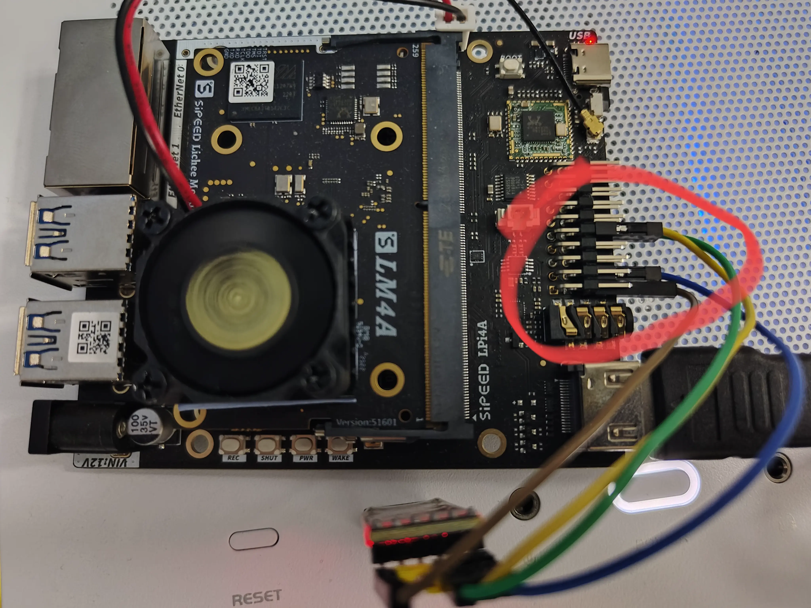
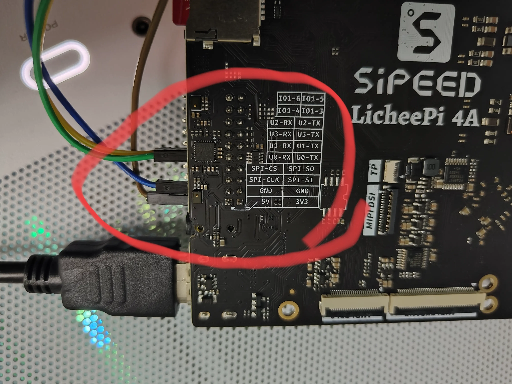

# NixOS on LicheePi 4A

> work in progress.

This repo contains the code to get NixOS running on LicheePi 4A.


Default user: `lp4a`, default password: `lp4a`.

## TODO

- [x] release an image
- [ ] build opensbi with nix
- [ ] build u-boot with nix
- [ ] debug with qemu

## Build boot & rootfs image

> You can skip this step if you just want to flash the prebuilt image.

Build sdImage(which may take a long time, about 2 hours on my machine):

```shell
nix build .#nixosConfigurations.lp4a.config.system.build.sdImage -L --show-trace
```

It take about 2 hours on my machine to build the image.
After the build is complete, the image will be in `result/sd-image/nixos-licheepi4a-sd-image-xxx-riscv64-linux.img`.

The image has some problem currently, we need to fix the partition sized by the following commands:

```bash
cp result/sd-image/nixos-licheepi4a-sd-image-xxx-riscv64-linux.img nixos-lp4a.img

# increase img's file size
dd if=/dev/zero bs=1M count=16 >> nixos-lp4a.img
sudo losetup --find --partscan nixos-lp4a.img

# check rootfs's status, it's broken.
sudo fsck /dev/loop0p2

# increase the rootfs's partition size & file system size
nix shell nixpkgs#cloud-utils
echo w | sudo fdisk /dev/loop0
sudo growpart /dev/loop0 2

# check rootfs's status again, it should be normal now.
sudo fsck /dev/loop0p2

# umount the image file
sudo losetup -d /dev/loop0
```

## Flash into SD card

> Official Docs: https://wiki.sipeed.com/hardware/en/lichee/th1520/lpi4a/4_burn_image.html

According to the official docs, the flash process of the internal test version LP4A hardware is as follows:

1. Press and hold the BOOT button on the board, then plug in the USB-C cable to power on (the other end of the cable is connected to the PC), and you can enter the USB burning mode (fastboot).
   1. the command `lsusb | grep T-HEAD` should print `ID 2345:7654 T-HEAD USB download gadget`
2. Then use the following command to flash the image into the board's eMMC.
   1. The fastboot program can be downloaded directly from [Android Platform Tools](https://developer.android.com/tools/releases/platform-tools), or installed from the package manager.

So first, download the prebuilt `u-boot-with-spl.bin` & `nixos-licheepi4a-sd-image-xxx-riscv64-linux.img.zst` from [releases](https://github.com/ryan4yin/nixos-licheepi4a/releases).

> The `u-boot-with-spl.bin` are built from [chainsx/fedora-riscv-builder](https://github.com/chainsx/fedora-riscv-builder/releases) currently.

Then, flash into the board's spl partition and uboot partition:

```bash
# flash u-boot into spl partition
sudo fastboot flash ram u-boot-with-spl.bin
sudo fastboot reboot
# flash uboot partition
sudo fastboot flash uboot u-boot-with-spl.bin
```

Finally, flash boot & rootfs into SD card:

```bash
zstd -d nixos-licheepi4a-sd-image-xxx-riscv64-linux.img.zst
sudo dd if=nixos-licheepi4a-sd-image-xxx-riscv64-linux.img of=/dev/sdX bs=4M status=progress
```

Now insert the SD card into the board, and power on, you should see NixOS booting.

## Debug with UART

When the system fails to boot, you can check the boot logs using tty.

First, connect the USB to TTL cable to the UART0 interface of the Raspberry Pi 4A. Then, use tools like 'screen' or 'minicom' to read and write to the serial port device.

```shell
› ls /dev/ttyUSB0
╭───┬──────────────┬─────────────┬──────┬───────────────╮
│ # │     name     │    type     │ size │   modified    │
├───┼──────────────┼─────────────┼──────┼───────────────┤
│ 0 │ /dev/ttyUSB0 │ char device │  0 B │ 6 minutes ago │
╰───┴──────────────┴─────────────┴──────┴───────────────╯

› minicom -d /dev/ttyusb0 -b 115200
```




If everything is normal, you should be able to see the startup log at this point. An example is shown below:

```
Welcome to minicom 2.8
brom_ver 8
[APP][E] protocol_connect failed, exit.
-----------------------------------------
  _____             _  _____ _____  _  __
 |  __ \           (_)/ ____|  __ \| |/ /
 | |__) |   _ _   _ _| (___ | |  | | ' / 
 |  _  / | | | | | | |\___ \| |  | |  <  
 | | \ \ |_| | |_| | |____) | |__| | . \ 
 |_|  \_\__,_|\__, |_|_____/|_____/|_|\_\
               __/ |                     
              |___/                      
                    -- Presented by ISCAS
-----------------------------------------

U-Boot SPL 2020.01-gc931dc82 (Jul 19 2023 - 17:16:05 +0000)
FM[1] lpddr4x dualrank freq=3733 64bit dbi_off=n sdram init
ddr initialized, jump to uboot
image has no header


U-Boot 2020.01-gc931dc82 (Jul 19 2023 - 17:16:05 +0000)

CPU:   rv64imafdcvsu
Model: T-HEAD c910 light
DRAM:  8 GiB
C910 CPU FREQ: 750MHz
AHB2_CPUSYS_HCLK FREQ: 250MHz
AHB3_CPUSYS_PCLK FREQ: 125MHz
PERISYS_AHB_HCLK FREQ: 250MHz
PERISYS_APB_PCLK FREQ: 62MHz
# ......
Hit any key to stop autoboot:  0 
85856 bytes read in 2 ms (40.9 MiB/s)
Retrieving file: /extlinux/extlinux.conf
869 bytes read in 1 ms (848.6 KiB/s)
1:      NixOS - Default
Retrieving file: /extlinux/../nixos/p5mnqd138g04r2ky25jqppiinfy8a9bj-initrd-k-riscv64-unknown-linux-gnu-d
8964096 bytes read in 98 ms (87.2 MiB/s)
Retrieving file: /extlinux/../nixos/7h8z0y2l6pr1dvlp3y6fgalghcl2pdwx-k-riscv64-unknown-linux-gnu-Image
29405184 bytes read in 319 ms (87.9 MiB/s)
append: init=/nix/store/5m21d2yswjpq47m1b32mc8359mfgdghx-nixos-system-nixos-23.05.20230624.3ef8b37/init 4
Retrieving file: /extlinux/../nixos/7h8z0y2l6pr1dvlp3y6fgalghcl2pdwx-k-riscv64-unknown-linux-gnu-dtbs/thb
87410 bytes read in 3 ms (27.8 MiB/s)
## Flattened Device Tree blob at 01f00000
   Booting using the fdt blob at 0x1f00000
   Loading Ramdisk to 1f773000, end 1ffff800 ... OK
   Using Device Tree in place at 0000000001f00000, end 0000000001f18571

Starting kernel ...

[    0.000000] Linux version 5.10.113 (nixbld@localhost) (riscv64-unknown-linux-gnu-gcc (GCC) 13.1.0, GN0
[    0.000000] OF: fdt: Ignoring memory range 0x0 - 0x200000
[    0.000000] earlycon: uart0 at MMIO32 0x000000ffe7014000 (options '115200n8')
[    0.000000] printk: bootconsole [uart0] enabled
[    2.331633] (NULL device *): failed to find vdmabuf_reserved_memory node
[    2.472010] spi-nor spi0.0: unrecognized JEDEC id bytes: ff ff ff ff ff ff
[    2.479021] dw_spi_mmio ffe700c000.spi: cs1 >= max 1
[    2.484044] spi_master spi0: spi_device register error /soc/spi@ffe700c000/spidev@1
[    2.514701] sdhci-dwcmshc ffe70a0000.sd: can't request region for resource [mem 0xffef014064-0xffef01]
[    2.526443] misc vhost-vdmabuf: failed to find vdmabuf_reserved_memory node
[    3.297567] debugfs: File 'SDOUT' in directory 'dapm' already present!
[    3.304265] debugfs: File 'Playback' in directory 'dapm' already present!
[    3.311109] debugfs: File 'Capture' in directory 'dapm' already present!
[    3.317849] debugfs: File 'Playback' in directory 'dapm' already present!
[    3.324694] debugfs: File 'Capture' in directory 'dapm' already present!
[    3.338624] aw87519_pa 5-0058: aw87519_parse_dt: no reset gpio provided failed
[    3.345901] aw87519_pa 5-0058: aw87519_i2c_probe: failed to parse device tree node

<<< NixOS Stage 1 >>>

running udev...
Starting systemd-udevd version 253.5
kbd_mode: KDSKBMODE: Inappropriate ioctl for device
Gstarting device mapper and LVM...
......
```

## How this repo works

LicheePi 4A use RevyOS officially.
The basic idea of this repo is to use revyos's kernel, u-boot and opensbi, with a NixOS rootfs, to get NixOS running on LicheePi 4A.

## See Also

RevyOS's kernel, u-boot and opensbi:

- https://github.com/revyos/thead-kernel.git
- https://github.com/revyos/thead-u-boot.git
- https://github.com/revyos/thead-opensbi.git

And other efforts to bring Fedora to LicheePi 4A:

- https://github.com/chainsx/fedora-riscv-builder

And other efforts to bring NixOS to RISC-V:

- https://github.com/zhaofengli/nixos-riscv64
- https://github.com/NickCao/nixos-riscv

Special thanks to @NickCao,  @revyos, @chainsx and @zhaofengli.

