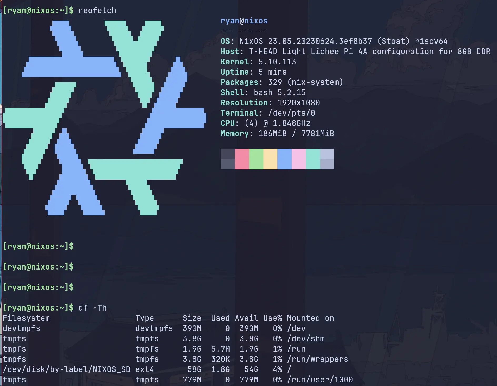

# NixOS on LicheePi 4A

This repo contains the code to get NixOS running on LicheePi 4A.



Default user: `lp4a`, default password: `lp4a`.

## TODO

- [x] release an image
- [x] build opensbi from source
- [x] build u-boot from source
- [x] support for booting from emmc
- [ ] fix the sdImage's file size
- [ ] fix the sdImage's auto resize after the first boot.
- [ ] Failed to enable firewall due to the error: `firewall-start[2300]: iptables: Failed to initialize nft: Protocol not supported`
- [ ] verify all the hardware features available by th1520
    - [x] ethernet (rj45)
    - [x] wifi
    - [ ] bluetooth
    - [ ] audio
    - [x] gpio
    - [x] uart/ttl
    - gpu(may not be possible)
    - npu(may not be possible)
    - ...

## Build u-boot & sdImage

> You can skip this step if you just want to flash the prebuilt image.


Build u-boot:

```shell
nix build .#uboot -L --show-trace
```

After the build is complete, the u-boot will be in `result/u-boot-with-spl.bin`, please copy it to another place for later use.

Build sdImage:

```shell
# I have uploaded the build cache to cachix, you can use it to speed up builds.
# which may take a long time without my cache, about 2 hours on my machine
nix run nixpkgs#cachix -- use licheepi4a

nix build .#sdImage -L --show-trace
```

After the build is complete, the image will be in `result/sd-image/nixos-licheepi4a-sd-image-xxx-riscv64-linux.img`.

The image has some problem currently, we need to fix the partition size by the following commands:

```bash
cp result/sd-image/nixos-licheepi4a-sd-image-*-riscv64-linux.img nixos-lp4a.img

chmod +w nixos-lp4a.img
# increase img's file size
dd if=/dev/zero bs=1M count=16 >> nixos-lp4a.img
sudo losetup --find --partscan nixos-lp4a.img

# check rootfs's status, it's broken.
sudo fsck /dev/loop0p2

echo w | sudo fdisk /dev/loop0
# increase the rootfs's partition size & file system size
nix shell nixpkgs#cloud-utils
sudo growpart /dev/loop0 2

# check rootfs's status again, it should be normal now.
sudo fsck /dev/loop0p2

# umount the image file
sudo losetup -d /dev/loop0
```

## Flash into SD card

> Official Docs: https://wiki.sipeed.com/hardware/en/lichee/th1520/lpi4a/4_burn_image.html

According to the official docs, the flash process of LicheePi 4A is as follows:

1. Press and hold the BOOT button on the board, then plug in the USB-C cable to power on (the other end of the cable is connected to the PC), and you can enter the USB burning mode (fastboot).
   1. the command `lsusb | grep T-HEAD` should print `ID 2345:7654 T-HEAD USB download gadget`
2. Then use the following command to flash the image into the board's eMMC.
   1. The fastboot program can be downloaded directly from [Android Platform Tools](https://developer.android.com/tools/releases/platform-tools), or installed from the package manager.

So first, download the prebuilt `u-boot-with-spl.bin` & `nixos-licheepi4a-sd-image-xxx-riscv64-linux.img.zst` from [releases](https://github.com/ryan4yin/nixos-licheepi4a/releases), or build them by yourself.

Then, flash into the board's spl partition and uboot partition:

```bash
# flash u-boot into spl partition
sudo fastboot flash ram u-boot-with-spl.bin
sudo fastboot reboot
# flash uboot partition
sudo fastboot flash uboot u-boot-with-spl.bin
```

Finally, flash boot & rootfs into SD card:

```bash
mv nixos-licheepi4a-sd-image-*-riscv64-linux.img.zst nixos-lp4a.img.zst
zstd -d nixos-lp4a.img.zst
# please replace `/dev/sdX` with your SD card's device name
sudo dd if=nixos-lp4a.img of=/dev/sdX bs=4M status=progress

# fix the wrong physical sector size
sudo parted /dev/sdb
```

Now insert the SD card into the board, and power on, you should see NixOS booting.

> Due to the problem of the image, you need to resize the rootfs manually after the first boot.

## Flash into eMMC

To flash the image into the board's eMMC, you need to flash the image into the board and start into NixOS first.

Then, use the following command to flash the image into the board's eMMC:

```bash
# upload the sdImage to the NixOS system on the board
scp nixos-lp4a.img lp4a@<ip-of-your-board>:~/

# login to the board via ssh or serial port
ssh lp4a@<ip-of-your-board>

# check all the block devices
# you should see mmcblk0(eMMC) & mmcblk1(SD card)
$ lsblk
NAME         MAJ:MIN RM   SIZE RO TYPE MOUNTPOINTS
mmcblk0      179:0    0  29.1G  0 disk 
├─mmcblk0p1  179:1    0   240M  0 part 
└─mmcblk0p2  179:2    0   1.6G  0 part 
mmcblk0boot0 179:8    0     4M  1 disk 
mmcblk0boot1 179:16   0     4M  1 disk 
mmcblk1      179:24   0 117.8G  0 disk 
├─mmcblk1p1  179:25   0   200M  0 part 
└─mmcblk1p2  179:26   0 117.5G  0 part /nix/store
                                       /

# flash the image into the board's eMMC
sudo dd if=nixos-lp4a.img of=/dev/mmcblk0 bs=4M status=progress
```

After the flash is complete, remove the SD card and reboot, you should see NixOS booting from eMMC.

> Due to the problem of the image, you need to resize the rootfs manually after the first boot.

## Debug via serial port

See [Debug.md](./Debug.md)

## Custom Deployment

You can use this flake as an input to build your own configuration.
Here is an example configuration that you can use as a starting point: [Demo - Deployment](./demo)

## How this repo works

LicheePi 4A use RevyOS officially.
The basic idea of this repo is to use revyos's kernel, u-boot and opensbi, with a NixOS rootfs, to get NixOS running on LicheePi 4A.

## See Also

RevyOS's kernel, u-boot and opensbi:

- https://github.com/revyos/thead-kernel.git
- https://github.com/revyos/thead-u-boot.git
- https://github.com/revyos/thead-opensbi.git

And other efforts to bring Fedora to LicheePi 4A:

- https://github.com/chainsx/fedora-riscv-builder

And other efforts to bring NixOS to RISC-V:

- https://github.com/zhaofengli/nixos-riscv64
- https://github.com/NickCao/nixos-riscv

Special thanks to @NickCao,  @revyos, @chainsx and @zhaofengli.

