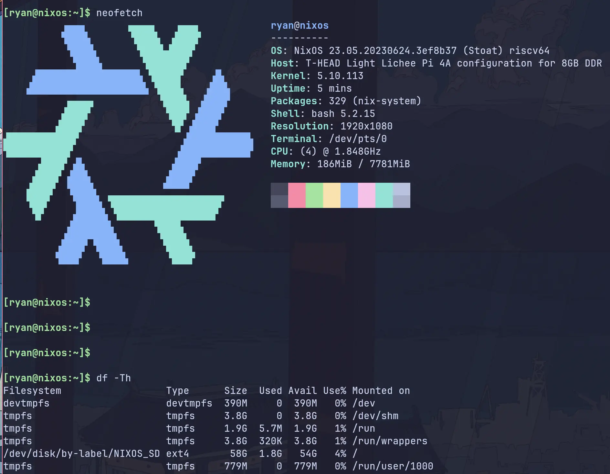

# NixOS on LicheePi 4A

This repo contains the code to get NixOS running on LicheePi 4A.



Default user: `lp4a`, default password: `lp4a`.

## Branches

See [discussion page](https://github.com/ngc7331/nixos-licheepi4a/discussions)

## Build u-boot & sdImage

> You can skip this step if you just want to flash the prebuilt image.

Build u-boot:

```bash
nix build .#uboot -L --show-trace
```

After the build is complete, the u-boot will be in `result/u-boot-with-spl.bin`, please copy it to another place for later use.

Build sdImage:

```bash
nix build .#sdImage -L --show-trace
```

After the build is complete, the image will be in `result/sd-image/nixos-licheepi4a-sd-image-xxx-riscv64-linux.img`.

The image has some problem currently, we need to fix the partition size by the following commands:

```bash
# the built result is not writeable, create a copy first
cp result/sd-image/nixos-licheepi4a-sd-image-*-riscv64-linux.img nixos-lp4a.img
chmod +w nixos-lp4a.img

# increase img's file size
dd if=/dev/zero bs=1M count=16 >> nixos-lp4a.img
sudo losetup --find --partscan nixos-lp4a.img

# check rootfs's status, it's broken.
sudo fsck /dev/loop0p2

echo w | sudo fdisk /dev/loop0
# increase the rootfs's partition size & file system size
sudo resize2fs /dev/loop0p2

# check rootfs's status again, it should be normal now.
sudo fsck /dev/loop0p2

# umount the image file
sudo losetup -d /dev/loop0
```

## Flash into SD card

> Official Docs: https://wiki.sipeed.com/hardware/en/lichee/th1520/lpi4a/4_burn_image.html

According to the official docs, the flash process of LicheePi 4A is as follows:

1. Press and hold the BOOT button on the board, then plug in the USB-C cable to power on (the other end of the cable is connected to the PC), and you can enter the USB burning mode (fastboot).
   1. the command `lsusb | grep T-HEAD` should print `ID 2345:7654 T-HEAD USB download gadget`
2. Then use the following command to flash the image into the board's eMMC.
   1. The fastboot program can be downloaded directly from [Android Platform Tools](https://developer.android.com/tools/releases/platform-tools), or installed from the package manager.

So first, download the prebuilt `u-boot-with-spl.bin` & `nixos-licheepi4a-sd-image-xxx-riscv64-linux.img.tar.zst` from [releases](https://github.com/ngc7331/nixos-licheepi4a/releases), or build them by yourself.

Then, flash into the board's spl partition and uboot partition:

```bash
# flash u-boot into spl partition
sudo fastboot flash ram u-boot-with-spl.bin
sudo fastboot reboot
# flash uboot partition
sudo fastboot flash uboot u-boot-with-spl.bin
```

Finally, flash boot & rootfs into SD card:

```bash
tar -xvf nixos-licheepi4a-sd-image-*-riscv64-linux.img.tar.zst
# please replace `/dev/sdX` with your SD card's device name
sudo dd if=./nixos-licheepi4a-sd-image-*-riscv64-linux.img of=/dev/sdX bs=4M status=progress

# fix the wrong physical sector size
sudo fdisk /dev/sdb
```

Please also refer to [scripts/flash_sd.sh](https://github.com/ngc7331/nixos-licheepi4a/blob/25.05/scripts/flash_sd.sh)

Now insert the SD card into the board, and power on, you should see NixOS booting.

> Due to the problem of the image, you need to resize the rootfs manually after the first boot.

## Flash into eMMC

To flash the image into the board's eMMC, you need to flash the image into the SD Card and boot into NixOS via it first.

Then, use the following command to flash the image into the board's eMMC:

```bash
# upload the sdImage to the NixOS system on the board
scp nixos-lp4a.img lp4a@<ip-of-your-board>:~/

# login to the board via ssh or serial port
ssh lp4a@<ip-of-your-board>

# check all the block devices
# you should see mmcblk0(eMMC) & mmcblk1(SD card)
$ lsblk
NAME         MAJ:MIN RM   SIZE RO TYPE MOUNTPOINTS
mmcblk0      179:0    0  29.1G  0 disk 
├─mmcblk0p1  179:1    0   240M  0 part 
└─mmcblk0p2  179:2    0   1.6G  0 part 
mmcblk0boot0 179:8    0     4M  1 disk 
mmcblk0boot1 179:16   0     4M  1 disk 
mmcblk1      179:24   0 117.8G  0 disk 
├─mmcblk1p1  179:25   0   200M  0 part 
└─mmcblk1p2  179:26   0 117.5G  0 part /nix/store
                                       /

# flash the image into the board's eMMC
sudo dd if=nixos-lp4a.img of=/dev/mmcblk0 bs=4M status=progress
```

After the flash is complete, remove the SD card and reboot, you should see NixOS booting from eMMC.

> Due to the problem of the image, you need to resize the rootfs manually after the first boot.

## TODOs & Known issue

- [ ] fix the sdImage's file size
- [ ] fix the sdImage's auto resize after the first boot.
- [ ] verify all the hardware features available by th1520
  - [ ] bluetooth
  - [ ] audio
  - [ ] gpu
    - The GPU driver of TH1520 is closed source, and it's high coupling with the operation system, make it quite difficult to make it work on NixOS.
  - [ ] npu
    - no one has seem to be done any work related to TH1520's NPU, and even licheepi4a's official docs does not contain any relevant contents(only a TODO).

Also refer to [discusstion page](https://github.com/ngc7331/nixos-licheepi4a/discussions) for branchs and other known issues.

## Kernel

This branch uses RevyOS's `revyos/linux` `revyos/7.0.y` kernel together with
the latest available TH1520 U-Boot, OpenSBI and boot firmware pins from RevyOS.

The flake input also tracks `nixos-unstable`.

## Vendor extension

Risc-v is a modulized architecture, it has loads of standard extensions and also allows manufacturers to add their own extensions.

C910, the core of TH1520, is a RISC-V core designed by T-Head, which is based on `rv64gc` and adds both standard and vendor extensions.

- Base
  - `rv64`: 64-bit based
  - `g`: shorthand of `imafd_zicsr_zifencei`
    - `i`: base interger isa
    - `m`: multiply / division
    - `a`: atomic
    - `f`: single-precision floating-point
    - `d`: double-precision floating-point
    - `zicsr`: control status register
    - `zifencei`: i-cache flush (for i-d consistency)
  - `c`: compressed (16 bit) instruction
- Standard
  - `Zfh`: half-precision floating-point
- Vendor
  - `Xtheadba`: address calculations
  - `Xtheadbb`: basic bit-manipulation
  - `Xtheadbs`: single-bit instructions
  - `Xtheadcmo`: cache management operations
  - `Xtheadcondmov`: conditional moves
  - `Xtheadfmemidx`: floating-point memory operations
  - `Xtheadfmv`: double floating-point high-bit data transmission instructions
  - `Xtheadint`: acceleration interruption instructions
  - `Xtheadmac`: multiply-accumulate
  - `Xtheadmemidx`: GPR memory operations
  - `Xtheadmempair`: two-GP-register memory operations
  - `Xtheadsync`: multi-processor synchronization

Ref: <https://en.wikipedia.org/wiki/RISC-V#ISA_base_and_extensions>
Ref: <https://github.com/XUANTIE-RV/thead-extension-spec>
Ref: <https://github.com/riscv-non-isa/riscv-toolchain-conventions/blob/main/src/toolchain-conventions.adoc>

We can enable these extensions to acquire better performance on LicheePi 4A.

To do this, we need to pass `-march=rv64gc_zfh_xtheadba_...` to gcc and `-cpu "rv64gc,zfh=true,xtheadba=true,..."` to qemu.

However, not all of the are supported by mainline toolchains currently, and some of them have buggy implementation in toolchains that fail compilation.

Known bugs:

- `Xtheadcondmov` causes gcc 13 ICE: <https://gcc.gnu.org/bugzilla/show_bug.cgi?id=109760>
- `Xtheadmampair` causes gcc 13.2.0 ICE: <https://gcc.gnu.org/bugzilla/show_bug.cgi?id=114160>, this is fixed in 13.3.0, so `nixos-24.11` should work
- `Xtheadint` is not supported by QEMU, even the latest 10.0 release

Also, nix has a very special cross-compilation system, making it hard to pass arguments to qemu.

I have some workarounds to make it build & boot, checkout branches starts with `xthead` (e.g. `xthead-24.05`), but it may be buggy, please use with caution.

## Debug via serial port

See [Debug.md](./Debug.md)

## Custom Deployment

The default image is a minimal NixOS system, which may not include all the applications you need.

You can clone this repository and modify `modules/licheepi4a.nix` to add your desired applications and configurations, and, follow the steps in [Build u-boot & sdImage](#build-u-boot--sdimage) to build your custom image. Then, you can flash it into your SD card or eMMC as described in [Flash into SD card](#flash-into-sd-card) and [Flash into eMMC](#flash-into-emmc).

Also, you can flash the default image and then modify the configuration on the board directly, you're able to use `nixos-rebuild switch` to apply your changes as a normal NixOS system, but this can be slow due to the limited resources of the board.

As an alternative, you can also use remote deployment to deploy your custom configuration to the board without re-building or re-flashing the image, this will keep your filesystem (e.g. `/home/user`) intact.

Here is an example configuration that you can use as a starting point: [Demo - Deployment](./demo)

## How this repo works

LicheePi 4A use RevyOS officially.
The basic idea of this repo is to use revyos's kernel, u-boot and opensbi, with a NixOS rootfs, to get NixOS running on LicheePi 4A.

## See Also

RevyOS's kernel, u-boot and opensbi:

- <https://github.com/revyos/thead-kernel.git>
- <https://github.com/revyos/thead-u-boot.git>
- <https://github.com/revyos/thead-opensbi.git>

And other efforts to bring Fedora to LicheePi 4A:

- <https://github.com/chainsx/fedora-riscv-builder>

And other efforts to bring NixOS to RISC-V:

- <https://github.com/zhaofengli/nixos-riscv64>
- <https://github.com/NickCao/nixos-riscv>

Special thanks to @NickCao,  @revyos, @chainsx and @zhaofengli.
